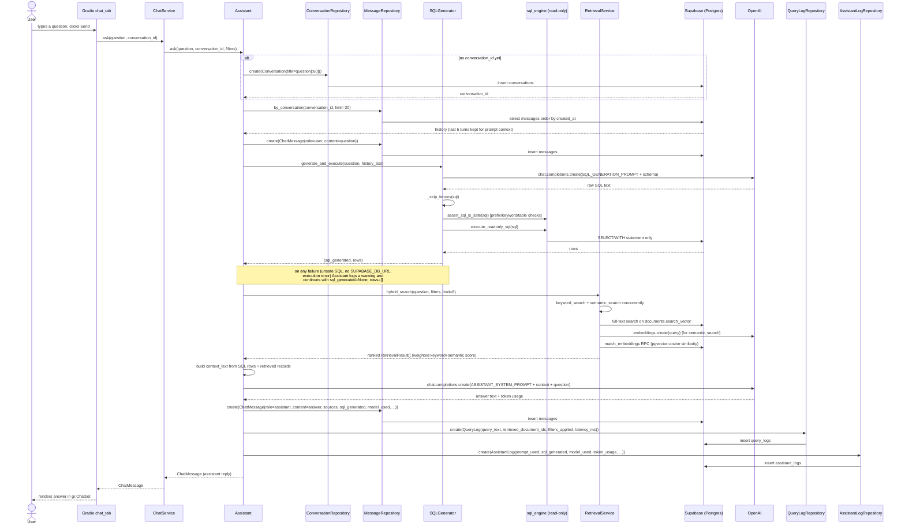

# Sequence Diagrams

These diagrams reflect the actual call order in `app/ingestion/pipeline.py` and
`app/ai/assistant.py` — not an idealized version of it. Error-handling branches are omitted for
readability; see `docs/architecture.md` and `docs/developer_guide.md` for how failures are
isolated.

## 1. Scrape-to-storage flow

`ScrapeService` (called from `scripts/run_scrape.py` or, in the future, the Gradio UI) resolves a
scraper from the registry, runs one of its scrape methods, and hands the resulting `ScrapeResult`
to `IngestionPipeline.ingest`.

```mermaid
sequenceDiagram
    actor User as User / CLI
    participant SS as ScrapeService
    participant Reg as apify registry
    participant Scr as Platform Scraper
    participant Apf as Apify Actor
    participant Norm as normalization/*
    participant Pipe as IngestionPipeline
    participant Repo as Repositories
    participant DB as Supabase (Postgres)
    participant Emb as EmbeddingService
    participant OAI as OpenAI

    User->>SS: scrape_posts(platform, identifier, limit)
    SS->>Reg: get_scraper(platform)
    Reg-->>SS: scraper instance
    SS->>Scr: scrape_posts(identifier, limit=limit)
    Scr->>Apf: ApifyActorRunner.run_and_fetch(actor_id, run_input)
    Apf-->>Scr: raw dataset items (list[dict])
    Scr->>Norm: normalize_author(item) / normalize_post(item)
    Norm-->>Scr: Author, Post (+ Media) Pydantic models
    Scr-->>SS: ScrapeResult(posts, authors, media, raw_item_count)
    SS->>Pipe: ingest(result, platform, job_type="posts", target=identifier)

    Pipe->>Repo: ScrapeJobRepository.start(...)
    Repo->>DB: insert scrape_jobs (status=running)

    Pipe->>Pipe: dedupe_by_key(authors, dedup_key)
    Pipe->>Repo: AuthorRepository.bulk_upsert_authors(authors)
    Repo->>DB: upsert authors on (platform, platform_user_id)
    DB-->>Repo: persisted authors (DB-assigned ids preserved on conflict)
    Pipe->>Pipe: _build_id_map(local authors, persisted authors) by dedup_key

    Pipe->>Pipe: remap posts.author_id via author_id_map
    Pipe->>Repo: PostRepository.bulk_upsert_posts(posts)
    Repo->>DB: upsert posts on (platform, platform_post_id)
    DB-->>Repo: persisted posts
    Pipe->>Pipe: _build_id_map(local posts, persisted posts) by dedup_key

    Pipe->>Repo: MediaRepository.bulk_create_media(new media only)
    Repo->>DB: insert media (post_id = persisted post id)

    Pipe->>Repo: HashtagRepository.bulk_upsert_tags / PostHashtagRepository.bulk_link
    Repo->>DB: upsert hashtags, link post_hashtags

    Pipe->>Repo: MentionRepository.bulk_create_mentions (new mentions only)
    Repo->>DB: insert mentions

    Pipe->>Norm: NORMALIZERS[platform].extract_engagement(post)
    Norm-->>Pipe: Engagement
    Pipe->>Repo: EngagementRepository.upsert_for_post(engagement)
    Repo->>DB: upsert engagement on (post_id)

    Pipe->>Emb: embed_batch(EmbeddableItem[] built from posts' caption/content)
    Emb->>Emb: checksum_of(text); skip if unchanged (get_by_checksum)
    Emb->>OAI: embeddings.create(model, input=texts) [only pending items]
    OAI-->>Emb: vectors
    Emb->>Repo: DocumentRepository.bulk_upsert(documents)
    Emb->>Repo: EmbeddingRepository.bulk_upsert_embeddings(rows)
    Repo->>DB: upsert documents, upsert embeddings

    Pipe->>Repo: ScrapeJobRepository.mark_succeeded / mark_partial
    Repo->>DB: update scrape_jobs (status, finished_at, records_scraped)
    Pipe-->>SS: IngestionReport(counts, errors)
    SS-->>User: IngestionReport
```

Notes:

- Comments follow the same upsert -> id-remap pattern as posts, plus a second pass
  (`_relink_comment_parents`) that points each reply's `parent_comment_id` at its parent's
  *persisted* id once every comment in the batch has one.
- Every `_safe_bulk` / per-entity ingestion step (`_ingest_media`, `_ingest_hashtags`,
  `_ingest_mentions`, `_ingest_engagement`, `_generate_embeddings`) catches its own exceptions and
  appends to `IngestionReport.errors` rather than raising — the job is marked `partial` (not
  `failed`) if any errors occurred but the run otherwise completed.

## 2. AI assistant chat flow

`Assistant.ask()` is the single entry point `ChatService` (and therefore the Gradio chat tab)
calls. It always persists the full turn even if SQL generation or retrieval fails partway through.



Notes:

- SQL generation and retrieval both run defensively: `Assistant.ask` wraps the
  `SQLGenerator.generate_and_execute` call and the `RetrievalService.hybrid_search` call each in
  their own `try/except`, logging a warning and continuing with an empty result on failure rather
  than aborting the turn — the chat completion always runs, even with no SQL and no retrieved
  records (in which case the context is literally `"(no relevant records found)"`).
- The final OpenAI chat completion is **not currently streamed**: `Assistant.ask` awaits one full
  `chat.completions.create` call, and the Gradio `_ask` callback (`app/gradio/chat_tab.py`) yields a
  `"_Thinking..."` placeholder once and then the full answer — token-by-token streaming is a
  documented future improvement, not implemented today.
